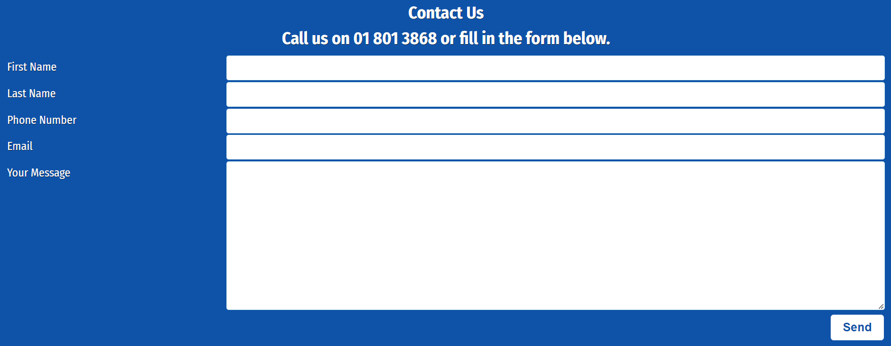

# Clonee Medical Centre

This website is designed for a real world doctors practice based in Clonee Co. Meath. 

They currently have no web presence other than a Facebook page. I decided to build a website for this practice.

## UX Benefits

This site will provide an overview of relevant information that a new or existing client may look for as well as a contact avenue for out of hours queries. This will save time, both for the patient and for the surgery whilst cutting down on admin time spent answering phones for simple queries.

## Design and colour scheme

My initial idea was to take Clonee Medical Centers existing logo and use the colours from this as a pallet for the site using a clear white background with navigation bars, header backgrounds etc being the logo colour. However lighthouse testing gave this scheme a poor accessibillity mark so the main colour was changed to a darker shade of blue. 

Original:  
  
Final:  

## Features

### index.html

#### Navigation bar 

+ Featured across all pages of the site and identical for ease of naviagation.
+ Text Logo for the practice with a menu linking to the home, contact us and services pages.
+ Mobile devices and smaller screens have a seperate toggable menu structure.
+ This section allows the user to easily navigate from page to page across all devices without having to revert back to the previous page via the ‘back’ button.

#### Hero Image

This bright and eyecatching image incorporates the existing logo for Clonee Medical Centre alongside an image of a doctors folded arms holding a stethoscope. The image is designed to immediately convey who we are and what we do. On mobile devices an alternative image of just the logo is displayed.

#### Quick Information Section

+ Designed using Flex so that the boxes are responsive and stack up on each other as screen size narrows. 
+ Icons from font awesome used to add visual appeal.
+ This section provides the answers to the main questions that Clonee Medical Center recieve over the phone every day.

#### Footer

+ Footer is constant across all pages of the site.
+ Google map iframe from maps.ie expands to 100% of screen size.
+ Features opening hours, phone number and address.
+ Phone number is clickable and will prompt to call or open dialer program from users device. 
+ Icons on each title from font awesome.

### contactus.html

#### Contact us form hero image.

I chose a picture from pexels.com of a doctors contact form and added the text of Clonee Medical Center to the form. This image clearly demonstrates what this page functions as and I felt was a nice link between old technology (paper and pen) and newer digital technology.

#### Contact Form

+ Uses flex so that the form stacks on itself on narrower devices.
+ Currently the form sends the user to a code institute confirmation page to confirm form submission. 

### services.html
#### Services section

A page listing the main current services offered by Clonee Medical Center. Image of a sick teddy bear used to convey a caring light touch. 

Same hero picture used here as on main page as it fits equally well and is consistent.

# Future development

I would add the following to future deployments:
+ Repcaptcha or similar to contact form to reduce risk of spam returns. This would require javascript not in the scope of the current project.
+ Google map currently uses an iframe from maps.ie which is giving a warning for third party cookies when checked using Lighthouse. I would amend this to use Googlemaps API.

# Testing

## Site Testing

A comprehensive site test was undertaken.
+ All links checked and working correctly.
+ All pages viewed using chromes developer tools in fully resposnsive mode. All pages behaved as expected with flex and media queries working well to amend output depending on screen size.
+ Contact us form correctly collects information and currently delivers to code institutes form dump page.

## Validation Testing 
W3.org validator contact us page missing div closing tag - Fixed  
Validator giving error for google maps iframe width - I had set width to 100% in the iframe which, although displayed at full width on all browsers failed html validation. I resolved this by placing the iframe in a div and used css to set the div to 100% width instead.

All pages now pass HTML and CSS Validation:

- HTML
  - No errors as per W3C Validator  
  Home Page: [W3C validator Home Page](https://validator.w3.org/nu/?doc=https%3A%2F%2Fpat-forde.github.io%2FProject-1-Clonee-Medical-Centre%2Findex.html)  
  Contact Us Page: [W3C validator Contact Us Page](https://validator.w3.org/nu/?doc=https%3A%2F%2Fpat-forde.github.io%2FProject-1-Clonee-Medical-Centre%2Fcontactus.html)  
  Services Page: [W3C validator Contact Us Page](https://validator.w3.org/nu/?doc=https%3A%2F%2Fpat-forde.github.io%2FProject-1-Clonee-Medical-Centre%2Fservices.html)  

- CSS
  - No errors as per [(Jigsaw) validator](https://jigsaw.w3.org/css-validator/validator?uri=https%3A%2F%2Fpat-forde.github.io%2FProject-1-Clonee-Medical-Centre%2Fassets%2Fcss%2Fstyle.css&profile=css3svg&usermedium=all&warning=1&vextwarning=&lang=en)

## Lighthouse Testing

### Performance

All pages score between 95% - 98%% each time the performance test has been undertaken. Changing the format of some of the images would bring this to 100%.

### Accessibillity

The initial lighthouse accessibillity score was in the low 80s and identified that the colour scheme used did not contrast enough. As a result I changed the colour scheme to a darker shade of blue. Lighthouse also identified a missing title in the google map iframe which I added. Added non displayed headers in the hero pics sections as non identified sections were flagged as bringing the score down  Lastly lighthouse suggested an issue with the order on the page of h1,h2 headers etc which was also amended to give a 100% score. 

### SEO Optimisation

All pages were missing a meta description. Added to achieve 100% SEO score.

### Best Practices

Best practices score is marked down to 78% due to the presence of third party cookies in the google maps iframe. This can be resolved by replacing the iframe with googles own API which uses javascript that is beyond the scope of this project. 

# Bugs 

+ Contact form overflowing into header and footer - Fixed  
+ Image not displaying on services page  - Fixed
+ Header menu bar was not displaying properly on full screens. Originally I had gotten around this by styling a fixed width header of 47% for larger screens. After a lot of testing and comparing with the love running project I realised that I had an error where I had allocated an ID to the nav bar itself rather than to the UL, and when the site was not acting as expected had made multiple alterations to the code to get it to display as I wanted. Header css was rewritten - Fixed 

# Credits

Main page picture made from picture sourced from pexels.com blended with actual logo of Clonee Medical Centre.  
Contact us page picture - modified from a picture sourced from pexels.com.  
Used technique learned from W3 schools to fix bug where the contact us form was overflowing into the header and footer.  
Nav bar uses a technique from Code Institutes love running project.
Icons sourced from FontAwesome.
Font supplied by Google Fonts

