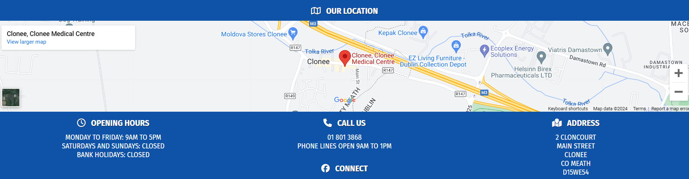
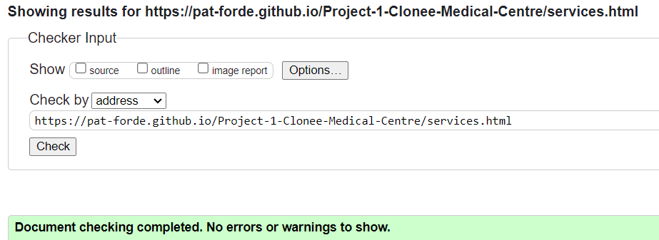

# Clonee Medical Centre

This website is designed for a real world doctors practice based in Clonee Co. Meath. They currently have no web presence other than a Facebook page. I decided to build a website for this practice.

## **[Live site](https://pat-forde.github.io/Project-1-Clonee-Medical-Centre/index.html)**

## **[Repository](https://github.com/Pat-Forde/Project-1-Clonee-Medical-Centre)**

## UX 

### Pre Project

I discussed the needs of the business with the practice manager and doctor. From these discussions I was able to determine the main user and business needs. The site needs to provide an overview of relevant information that a new or existing client may look for as well as a contact avenue for out of hours queries. This will save time, both for the patient and for the surgery whilst cutting down on admin time spent answering phones for simple queries.

### User Stories

### User
> As a user and prospective new patient I want to be able to find a doctor in my local area.
> As a user and prospective new patient I want to be able to see the location of the center and get directions.
> As a user and prospective new patient I want to be able to find out if the center is taking on new patients and the services that the center provides.
> As a user I want to be able to contact the center online.  
> As a user I want to be able to find out when the center is open.

### Business Owner
> As the site owner I want to be able to showcase my practice to prospective patients.
> As the site owner I want to show the user my opening hours.  
> As the site owner I want to provide a source of quick information to benefit new and existing patients.
> As the site owner I want to reduce the workload of the practice manager and reception staff.
   
### Design

I decided the best way to achieve the overall UX benefits was to incorporate:

+ A uniform header and footer across all pages.
+ A footer to include directions and contact information visible on all pages.
+ A main page to clearly display the answers to the most commonly asked queries by new and existing patients.
+ A separate contact page for patient queries.
+ A separate services page listing current services offered by the practice.

### Colour scheme

The site uses Blue as a main colour. Blue was chosen due to this colour being typically associated with credibility, trust, knowledge, power, professionalism, cleanliness, calm and focus. Because all of these qualities are valued in the medical community, blue is generally an ideal choice for medical communities and websites. My initial idea was to take Clonee Medical Centers existing logo and use the colours from this as a palette for the site using a clear white background with navigation bars, header backgrounds etc being the logo colour. However lighthouse testing gave this scheme a poor accessibillity mark so the main colour was changed to a darker shade of blue. 

Original:  
  
Final:  

## Features

### index.html

#### Navigation bar 

+ Featured across all pages of the site and identical for ease of naviagation.
+ Text Logo for the practice with a menu linking to the home, contact us and services pages.
+ Mobile devices and smaller screens have a seperate toggable menu structure.
+ This section allows the user to easily navigate from page to page across all devices without having to revert back to the previous page via the ‘back’ button.

#### Hero Image

This bright and eyecatching image incorporates the existing logo for Clonee Medical Centre alongside an image of a doctors folded arms holding a stethoscope. The image is designed to immediately convey who we are and what we do. On mobile devices an alternative image of just the logo is displayed.

#### Quick Information Section

+ Designed using Flex so that the boxes are responsive and stack up on each other as screen size narrows. 
+ Icons from font awesome used to add visual appeal.
+ This section provides the answers to the main questions that Clonee Medical Center receive over the phone every day.

#### Footer

+ Footer is constant across all pages of the site.
+ Google map iframe from maps.ie expands to 100% of screen size.
+ Features opening hours, phone number and address.
+ Phone number is clickable and will prompt to call or open dialer program from users device. 
+ Icons on each title from font awesome.

### contactus.html

#### Contact us form hero image.

I chose a picture from pexels.com of a doctors contact form and added the text of Clonee Medical Center to the form. This image clearly demonstrates what this page functions as and I felt was a nice link between old technology (paper and pen) and newer digital technology.

#### Contact Form

+ Uses flex so that the form stacks on itself on narrower devices.
+ For the benefit of the user experience of this project the form redirects users to a form submitted / thank you page. Form processing is currently beyond the scope of this project. However, the form was tested and confirmed to be collecting data as expected using form institutes form dump webpage. Form processing functionallity would be added prior to real world deployment.

### services.html
#### Services section

A page listing the main current services offered by Clonee Medical Center. 

+ Same hero picture used here as on main page as it fits equally well and is consistent.
+ Image of a sick teddy bear used to convey a caring light touch. 
+ Services listed in site colour scheme.
+ On mobiles and narrower screens image stacks on top of services list.

## Deployment

To deploy the project I followed the steps below starting from the [main project repository](https://github.com/Pat-Forde/Project-1-Clonee-Medical-Centre).

 1. Clicked on `Settings` on the navigation menu in the repository
 2. I then selected the `Pages` menu on the side bar.
 3. In the first dropdown menu labeled `Source` I selected the branch of the name `main` from the dropdown.
 4. In the next dropdown labeled `/root` I left as the default option.
 5. Selected Save
 
  The project was then deployed.
  

## Testing

  **Links and user inputs**
  | Test |Outcome  |
  |--|--|
  |All links in naviagation bar lead to their correct pages.| Pass  |
  |Phone numbers are active links which call up dialer program on device.| Pass |
  |Facebook link in footer opens new window and correct page. | Pass |
  |Contact form submits when all criteria is filled correctly.| Pass |
  |User is prevented from submitting the form without correct elements present. | Pass |
  |Form validation presents when incorrect input type is entered |Pass|

  **Responsiveness**
  | Test |Outcome  |
  |--|--|
  |Home page, contact us and services pages display correctly on mobile device 320px wide| Pass |
  |Home page, contact us and services pages display correctly on tablet 768px wide| Pass |
  |Home page, contact us and services pages display correctly on laptop 1280px wide| Pass |
  |Home page, contact us and services pages display correctly on desktop 1600px wide| Pass |
  |Home page and contact us page hero image swaps to alternate image on wider screens | Pass |

## Validation Testing 
W3.org validator contact us page missing div closing tag - Fixed  
Validator giving error for google maps iframe width - I had set width to 100% in the iframe which, although displayed at full width on all browsers failed html validation. I resolved this by placing the iframe in a div and used css to set the div to 100% width instead.

All pages now pass HTML and CSS Validation:

- HTML
  - No errors as per W3C Validator  
    
  Home Page: [W3C validator Home Page](https://validator.w3.org/nu/?doc=https%3A%2F%2Fpat-forde.github.io%2FProject-1-Clonee-Medical-Centre%2Findex.html)

      
  Contact Us Page: [W3C validator Contact Us Page](https://validator.w3.org/nu/?doc=https%3A%2F%2Fpat-forde.github.io%2FProject-1-Clonee-Medical-Centre%2Fcontactus.html) 

     
  Services Page: [W3C validator Services Page](https://validator.w3.org/nu/?doc=https%3A%2F%2Fpat-forde.github.io%2FProject-1-Clonee-Medical-Centre%2Fservices.html)  

- CSS
  - No errors as per W3C CSS Jigsaw Validator
  
   [(Jigsaw) validator](https://jigsaw.w3.org/css-validator/validator?uri=https%3A%2F%2Fpat-forde.github.io%2FProject-1-Clonee-Medical-Centre%2Fassets%2Fcss%2Fstyle.css&profile=css3svg&usermedium=all&warning=1&vextwarning=&lang=en)

## Lighthouse Testing

  **index.html**  

  **contact.html**  

  **services.html**  

  **submitted.html**  

  ### Performance

  All pages score between 92% - 99%% each time the performance test has been undertaken. Changing the format of some of the images would bring this to 100%.

  ### Accessibillity

  The initial lighthouse accessibillity score was in the low 80s and identified that the colour scheme used did not contrast enough. As a result I changed the colour scheme to a darker shade of blue. Lighthouse also identified a missing title in the google map iframe which I added. I also added non displayed headers in the hero pics sections as non identified sections were flagged as bringing the score down  Lastly lighthouse suggested an issue with the order on the page of h1,h2 headers etc which was also amended to give a 100% score. 

  ### SEO Optimisation

  All pages were missing a meta description. Added to achieve 100% SEO score.

  ### Best Practices

  Best practices score is marked down to 78% due to the presence of third party cookies in the google maps iframe. This can be resolved by replacing the iframe with googles own API which uses javascript that is beyond the scope of this project. 

## Bugs 

+ Contact form overflowing into header and footer - Fixed  
+ Image not displaying on services page  - Fixed
+ Header menu bar was not displaying properly on full screens. Originally I had gotten around this by styling a fixed width       header of 47% for larger screens. After a lot of testing and comparing with the love running project I realised that I had an error where I had allocated an ID to the nav bar itself rather than to the UL, and when the site was not acting as expected had made multiple alterations to the code to get it to display as I wanted. Header css was rewritten - Fixed
+ Header was wrapping onto a new line at exactly 768px but not at 769px and above (768px wide is a media query break point on the site) Adjusted header text size very slightly to resolve. - FIXED

## Future development

I would add the following to future deployments:
+ Repcaptcha or similar to contact form to reduce risk of spam returns. This would require javascript not in the scope of the current project.
+ Google map currently uses an iframe from maps.ie which is giving a warning for third party cookies when checked using Lighthouse. I would amend this to use Googlemaps API.
+ The contact form currently solely returns to a form submitted page for the beneift of user experience in this project. I would amend this to have the form data process properly which again would use learning and technologies not in the scope of this project.
+ A facility to pay online for appointments, repeat prescriptions etc.
+ Services page services list would expand on click with further information on each service.
+ Profiles of Doctor and practice staff.

## Credits

+ Main page picture made from picture sourced from pexels.com blended with actual logo of Clonee Medical Centre. 
+ Contact us page picture - modified from a picture sourced from pexels.com.  
+ Used technique learned from W3 schools to fix bug where the contact us form was overflowing into the header and footer.  
+ Nav bar uses a technique from Code Institutes love running project.
+ Icons sourced from FontAwesome.
+ Font supplied by Google Fonts
+ Further learning and support from Code Institute Slack Channels, Stackoverflow.com, Flexboxfroggy.com. 

## Thank You
  
  A huge thank you to my Code Institute mentor Alan Bushell for his patience, guidance, support, encouragement and overall mentorship during this project.
